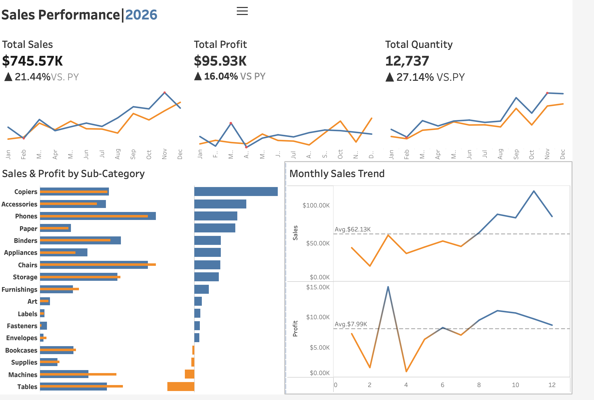

# Superstore Sales Analysis

## Project Overview

This project analyzes Superstore sales data to identify trends in sales, profitability, product performance, and overall business performance.

The analysis follows an end-to-end data analytics workflow, including data validation and cleaning, SQL analysis, Excel dashboard development, Tableau visualization, and business insight generation.

The goal is to transform raw transactional data into meaningful insights that can support data-driven business decisions.

## Tools & Technologies

- **SQL:** PostgreSQL
- **Database Tool:** DBeaver
- **Spreadsheet Analysis:** Microsoft Excel
- **Data Visualization:** Tableau
- **Data Source:** Superstore transactional dataset

- ## Project Workflow

1. **Data Validation & Cleaning**
   - Checked row counts and missing values
   - Identified and removed duplicate records
   - Validated order and shipping dates
   - Prepared a cleaned dataset for analysis

2. **SQL Analysis**
   - Calculated key business KPIs
   - Analyzed sales and profit by category and sub-category
   - Analyzed monthly sales and profit trends
   - Performed year-over-year performance analysis
   - Investigated profitability issues within specific sub-categories

3. **Excel Dashboard**
   - Created KPI cards for key performance metrics
   - Built sales and profit visualizations
   - Added monthly sales trends and product performance analysis
   - Added interactive Region filtering

4. **Tableau Dashboard**
   - Created interactive sales and profitability visualizations
   - Analyzed monthly and year-over-year performance
   - Compared sub-category sales and profitability
   - Added interactive filtering for dashboard analysis

5. **Business Insights & Recommendations**
   - Identified key performance trends
   - Investigated profitability issues
   - Developed actionable recommendations based on the analysis
  
   - ## Key Business Insights

- **Overall Performance:** Sales increased **21.44% YoY**, while profit increased **16.04%** and quantity increased **27.14%**. The faster growth in quantity may indicate lower revenue and profit generated per unit, warranting further investigation into product mix, pricing, and discounting.

- **Monthly Performance:** **November 2026** generated the highest monthly sales at **$118.45K**, while **February 2026** recorded the lowest at **$20.30K**, indicating potential seasonal or demand-related fluctuations.

- **Sub-Category Performance:** **Phones** generated the highest sales at **$105.67K**, while **Copiers** generated the highest profit at **$25.04K**. This demonstrates that the highest-sales sub-category does not necessarily generate the highest profit.

- **Tables Profitability:** In **2026**, Tables generated approximately **$61.0K in sales but incurred a loss of $8.09K**. The average discount was **26%**, indicating that discounting may be a contributing factor to the negative profitability.

- ## Business Recommendations

1. **Investigate Tables Profitability**
   - Review the Tables sub-category at the product level to identify the main drivers of negative profitability.
   - Analyze discount levels, pricing, and product-level margins before making changes to discount strategies.

2. **Investigate the Sales-to-Profit Growth Gap**
   - Analyze why quantity growth of **27.14%** is outpacing sales growth of **21.44%** and profit growth of **16.04%**.
   - Further evaluate product mix, pricing, discounting, and profitability per unit.

3. **Leverage High-Performing Areas**
   - Analyze the factors contributing to the strong performance of **Phones and Copiers**, as well as the strong November sales period.
   - Identify successful product, pricing, and sales patterns that could potentially be replicated in other areas.
  
   - ## Project Files

| File | Description |
|---|---|
| `superstore_clean.csv` | Cleaned dataset used for the analysis |
| `superstore_analysis.sql` | PostgreSQL queries for data validation, KPI analysis, and business analysis |
| `superstore_excel_dashboard.xlsx` | Excel dashboard with KPIs, trends, and performance analysis |
| `Sales Dashboard.twbx` | Tableau workbook containing the interactive dashboard |
| `Business Insights` | Detailed business findings and recommendations |

## Conclusion

This project demonstrates an end-to-end data analysis workflow, from data validation and SQL analysis to dashboard development and business insight generation.

The analysis highlights key trends in sales, profitability, product performance, and business growth while demonstrating how data can be transformed into actionable business recommendations.
